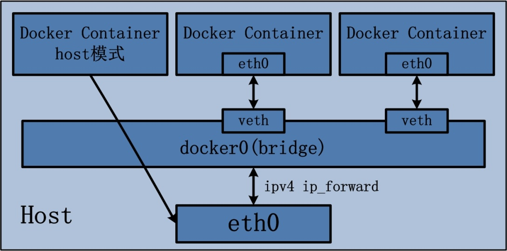
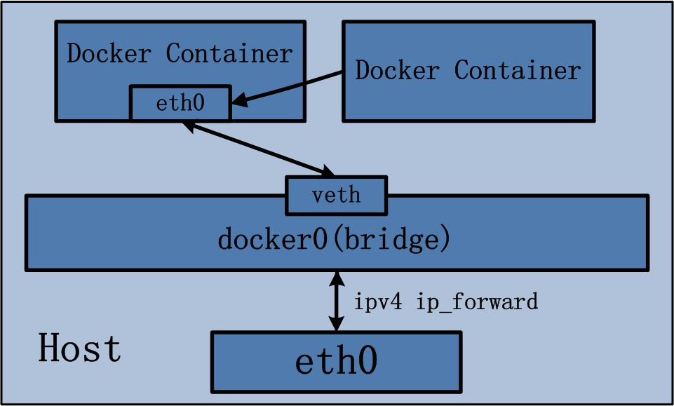
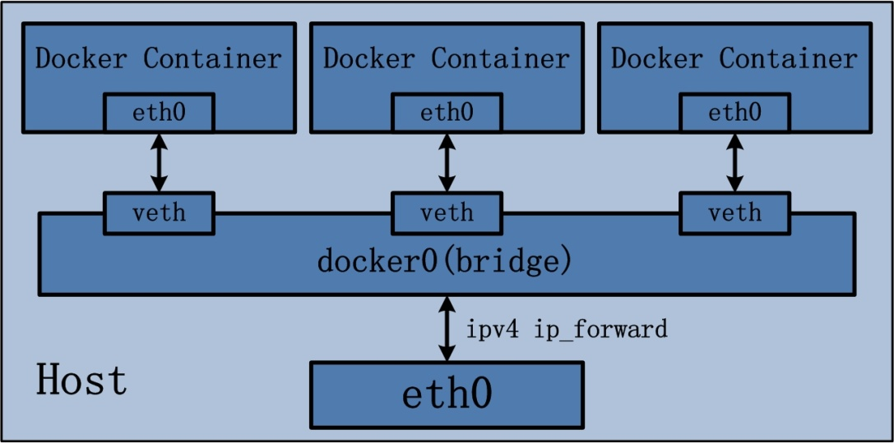

#概述
  在使用`docker run`命令创建容器时，可以用--net选项指定容器的网络模式，此选项有以下4种网络模式：
+ host模式，使用--net=host指定。  
+ container模式，使用-net=container:NAME_or_ID指定。  
+ none模式，使用--net=none指定。  
+ bridge模式，使用--net=bridge指定，默认设置。  
 
下面分别介绍一下Docker的各个网络模式。
#host模式
Docker Container中的host模式与bridge桥接模式有很大的不同。最大的区别当属，host模式并没有为容器创建一个隔离的网络环境。而之所以称之为host模式，是因为该模式下的Docker Container会和host宿主机共享同一个网络namespace，故Docker Container可以和宿主机一样，使用宿主机的eth0，实现和外界的通信。换言之，Docker Container的IP地址即为宿主机eth0的IP地址。

Docker Container的host网络模式可以参考下图：

上图最左侧的Docker Container，即采用了host网络模式，而其他两个Docker Container依然沿用brdige桥接模式，两种模式同时存在于宿主机上并不矛盾。

Docker Container的host网络模式在实现过程中，由于不需要额外的网桥以及虚拟网卡，故不会涉及docker0以及veth pair。上文namespace的介绍中曾经提到，父进程在创建子进程时，如果不使用CLONE_NEWNET这个参数标志，那么创建出的子进程会与父进程共享同一个网络namespace。Docker就是采用了这个简单的原理，在创建进程启动容器的过程中，没有传入CLONE_NEWNET参数标志，实现Docker Container与宿主机共享同一个网络环境，即实现host网络模式。

可以说，Docker Container的网络模式中，host模式是bridge桥接模式很好的补充。采用host模式的Docker Container，可以直接使用宿主机的IP地址与外界进行通信，若宿主机的eth0是一个公有IP，那么容器也拥有这个公有IP。同时容器内服务的端口也可以使用宿主机的端口，无需额外进行NAT转换。当然，有这样的方便，肯定会损失部分其他的特性，最明显的是Docker Container网络环境隔离性的弱化，即容器不再拥有隔离、独立的网络栈。另外，使用host模式的Docker Container虽然可以让容器内部的服务和传统情况无差别、无改造的使用，但是由于网络隔离性的弱化，该容器会与宿主机共享竞争网络栈的使用；另外，容器内部将不再拥有所有的端口资源，原因是部分端口资源已经被宿主机本身的服务占用，还有部分端口已经用以bridge网络模式容器的端口映射。
#container模式
container网络模式是Docker中一种较为特别的网络的模式。之所以称为“other container模式”，是因为这个模式下的Docker Container，会使用其他容器的网络环境。之所以称为“特别”，是因为这个模式下容器的网络隔离性会处于bridge桥接模式与host模式之间。Docker Container共享其他容器的网络环境，则至少这两个容器之间不存在网络隔离，而这两个容器又与宿主机以及除此之外其他的容器存在网络隔离。
container网络模式可以参考下图：

container网络模式在实现过程中，不涉及网桥，同样也不需要创建虚拟网卡veth pair。完成other container网络模式的创建只需要两个步骤：

(1) 查找other container（即需要被共享网络环境的容器）的网络namespace；

(2) 将新创建的Docker Container（也是需要共享其他网络的容器）的namespace，使用other container的namespace。

Docker Container的other container网络模式，可以用来更好的服务于容器间的通信。

在这种模式下的Docker Container可以通过localhost来访问namespace下的其他容器，传输效率较高。虽然多个容器共享网络环境，但是多个容器形成的整体依然与宿主机以及其他容器形成网络隔离。另外，这种模式还节约了一定数量的网络资源。但是需要注意的是，它并没有改善容器与宿主机以外世界通信的情况。
#none模式

这个模式和前两个不同。在这种模式下，Docker容器拥有自己的Network Namespace，但是，并不为Docker容器进行任何网络配置。也就是说，none模式为容器做了最少的网络设定，但是俗话说得好“少即是多”，在没有网络配置的情况下，才能在这基础做其他无限多可能的网络定制开发。这也恰巧体现了Docker设计理念的开放。
#bridge模式

Docker Container的bridge桥接模式可以说是目前Docker开发者最常使用的网络模式。Brdige桥接模式为Docker Container创建独立的网络栈，保证容器内的进程组使用独立的网络环境，实现容器间、容器与宿主机之间的网络栈隔离。另外，Docker通过宿主机上的网桥(docker0)来连通容器内部的网络栈与宿主机的网络栈，实现容器与宿主机乃至外界的网络通信。

Docker Container的bridge桥接模式可以参考下图：

Bridge桥接模式，从原理上实现了Docker Container到宿主机乃至其他机器的网络连通性。然而，由于宿主机的IP地址与veth pair的 IP地址均不在同一个网段，故仅仅依靠veth pair和namespace的技术，还不足以是宿主机以外的网络主动发现Docker Container的存在。为了使得Docker Container可以让宿主机以外的世界感知到容器内部暴露的服务，Docker采用NAT（Network Address Translation，网络地址转换）的方式，让宿主机以外的世界可以主动将网络报文发送至容器内部。

具体来讲，当Docker Container需要暴露服务时，内部服务必须监听容器IP和端口号port_0，以便外界主动发起访问请求。由于宿主机以外的世界，只知道宿主机eth0的网络地址，而并不知道Docker Container的IP地址，哪怕就算知道Docker Container的IP地址，从二层网络的角度来讲，外界也无法直接通过Docker Container的IP地址访问容器内部应用。因此，Docker使用NAT方法，将容器内部的服务监听的端口与宿主机的某一个端口port_1进行“绑定”。

如此一来，外界访问Docker Container内部服务的流程为：

(1) 外界访问宿主机的IP以及宿主机的端口port_1；

(2) 当宿主机接收到这样的请求之后，由于DNAT规则的存在，会将该请求的目的IP（宿主机eth0的IP）和目的端口port_1进行转换，转换为容器IP和容器的端口port_0;

(3) 由于宿主机认识容器IP，故可以将请求发送给veth pair；

(4) veth pair的veth0将请求发送至容器内部的eth0，最终交给内部服务进行处理。

使用DNAT方法，可以使得Docker宿主机以外的世界主动访问Docker Container内部服务。那么Docker Container如何访问宿主机以外的世界呢。以下简要分析Docker Container访问宿主机以外世界的流程：

(1) Docker Container内部进程获悉宿主机以外服务的IP地址和端口port_2，于是Docker Container发起请求。容器的独立网络环境保证了请求中报文的源IP地址为容器IP（即容器内部eth0），另外Linux内核会自动为进程分配一个可用源端口（假设为port_3）;

(2) 请求通过容器内部eth0发送至veth pair的另一端，到达veth0，也就是到达了网桥（docker0）处；

(3) docker0网桥开启了数据报转发功能（/proc/sys/net/ipv4/ip_forward），故将请求发送至宿主机的eth0处；

(4) 宿主机处理请求时，使用SNAT对请求进行源地址IP转换，即将请求中源地址IP（容器IP地址）转换为宿主机eth0的IP地址；

(5) 宿主机将经过SNAT转换后的报文通过请求的目的IP地址（宿主机以外世界的IP地址）发送至外界。

在这里，很多人肯定会问：对于Docker Container内部主动发起对外的网络请求，当请求到达宿主机进行SNAT处理后发给外界，当外界响应请求时，响应报文中的目的IP地址肯定是Docker宿主机的IP地址，那响应报文回到宿主机的时候，宿主机又是如何转给Docker Container的呢？关于这样的响应，由于port_3端口并没有在宿主机上做相应的DNAT转换，原则上不会被发送至容器内部。为什么说对于这样的响应，不会做DNAT转换呢。原因很简单，DNAT转换是针对容器内部服务监听的特定端口做的，该端口是供服务监听使用，而容器内部发起的请求报文中，源端口号肯定不会占用服务监听的端口，故容器内部发起请求的响应不会在宿主机上经过DNAT处理。

其实，这一环节的内容是由iptables规则来完成，具体的iptables规则如下：

iptables -I FORWARD -o docker0 -m conntrack --ctstate RELATED,ESTABLISHED -j ACCEPT
这条规则的意思是，在宿主机上发往docker0网桥的网络数据报文，如果是该数据报文所处的连接已经建立的话，则无条件接受，并由Linux内核将其发送到原来的连接上，即回到Docker Container内部。

以上便是Docker Container中bridge桥接模式的简要介绍。可以说，bridger桥接模式从功能的角度实现了两个方面：第一，让容器拥有独立、隔离的网络栈；第二，让容器和宿主机以外的世界通过NAT建立通信。

然而，bridge桥接模式下的Docker Container在使用时，并非为开发者包办了一切。最明显的是，该模式下Docker Container不具有一个公有IP，即和宿主机的eth0不处于同一个网段。导致的结果是宿主机以外的世界不能直接和容器进行通信。虽然NAT模式经过中间处理实现了这一点，但是NAT模式仍然存在问题与不便，如：容器均需要在宿主机上竞争端口，容器内部服务的访问者需要使用服务发现获知服务的外部端口等。另外NAT模式由于是在三层网络上的实现手段，故肯定会影响网络的传输效率。