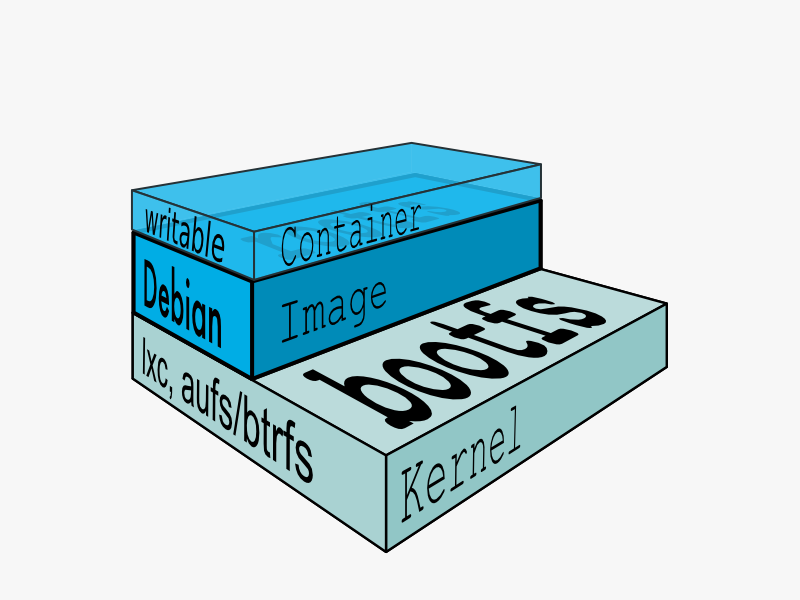
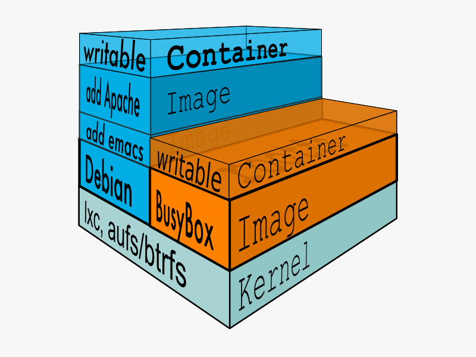

 infoq上[深入浅出Docker（一）：Docker核心技术预览](http://www.infoq.com/cn/articles/docker-core-technology-preview)一文中非常详细地描述了AUFS构建成镜像、容器的完整过程，此处只做引用。  
AUFS (AnotherUnionFS) 是一种 Union FS, 简单来说就是支持将不同目录挂载到同一个虚拟文件系统下(unite several directories into a single virtual filesystem)的文件系统, 更进一步的理解, AUFS支持为每一个成员目录(类似Git Branch)设定readonly、readwrite 和 whiteout-able 权限, 同时 AUFS 里有一个类似分层的概念, 对 readonly 权限的 branch 可以逻辑上进行修改(增量地, 不影响 readonly 部分的)。通常 Union FS 有两个用途, 一方面可以实现不借助 LVM、RAID 将多个disk挂到同一个目录下, 另一个更常用的就是将一个 readonly 的 branch 和一个 writeable 的 branch 联合在一起，Live CD正是基于此方法可以允许在 OS image 不变的基础上允许用户在其上进行一些写操作。Docker 在 AUFS 上构建的 container image 也正是如此，接下来我们从启动 container 中的 linux 为例来介绍 docker 对AUFS特性的运用。

典型的启动Linux运行需要两个FS: bootfs + rootfs:

bootfs (boot file system) 主要包含 bootloader 和 kernel, bootloader主要是引导加载kernel, 当boot成功后 kernel 被加载到内存中后 bootfs就被umount了. rootfs (root file system) 包含的就是典型 Linux 系统中的 /dev, /proc,/bin, /etc 等标准目录和文件。

对于不同的linux发行版, bootfs基本是一致的, 但rootfs会有差别, 因此不同的发行版可以公用bootfs 如下图:  

典型的Linux在启动后，首先将 rootfs 设置为 readonly, 进行一系列检查, 然后将其切换为 "readwrite" 供用户使用。在Docker中，初始化时也是将 rootfs 以readonly方式加载并检查，然而接下来利用 union mount 的方式将一个 readwrite 文件系统挂载在 readonly 的rootfs之上，并且允许再次将下层的 FS(file system) 设定为readonly 并且向上叠加, 这样一组readonly和一个writeable的结构构成一个container的运行时态, 每一个FS被称作一个FS层。如下图:

得益于AUFS的特性, 每一个对readonly层文件/目录的修改都只会存在于上层的writeable层中。这样由于不存在竞争, 多个container可以共享readonly的FS层。 所以Docker将readonly的FS层称作 "image" - 对于container而言整个rootfs都是read-write的，但事实上所有的修改都写入最上层的writeable层中, image不保存用户状态，只用于模板、新建和复制使用。

上层的image依赖下层的image，因此Docker中把下层的image称作父image，没有父image的image称作base image。因此想要从一个image启动一个container，Docker会先加载这个image和依赖的父images以及base image，用户的进程运行在writeable的layer中。所有parent image中的数据信息以及 ID、网络和lxc管理的资源限制等具体container的配置，构成一个Docker概念上的container。如下图:
。

