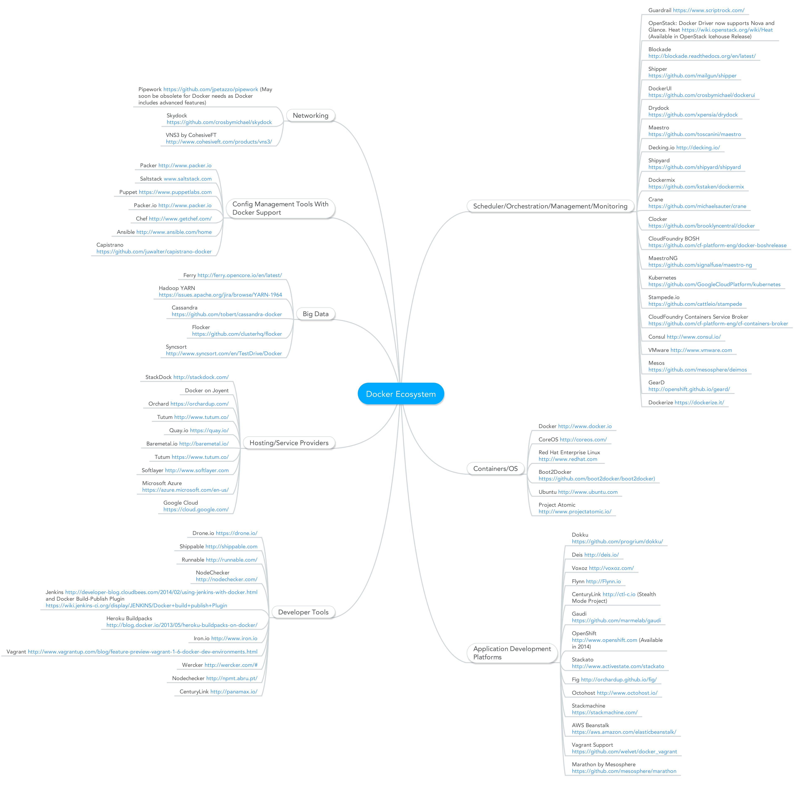

#docker基本概念
##1.1 docker是什么
  从docker的[官方声明](https://www.docker.com/whatisdocker/)中可以看出，docker可以用于构建(build)、分发(ship)、运行(run)发布好的应用。  
  docker主要包含以下两个部分：
+ docker engine：独立于Hypervisor实现容器管理的引擎，直接基于Linux内核进行实现。  
+ docker hub：分发和共享镜像使用SaaS服务。  
  
>docker减少了开发人员、QA人员、运维人员以及用户之间的沟通隔阂，使快速、一致地部署生产环境成为可能，提高了整个IT生产体系的效率。  
  
  默认情况下，docker采用namespace实现运行环境的隔离，通过cgroups提供资源配额管理和使用，通过aufs进行存储资源的控制。后面会对这些相关技术进行比较详细的介绍。

##1.2 docker的应用场景
  docker的官方博客对自身的应用场景进行了简单描述，主要包括以下应用场景。  

+ 对应用进行自动打包和部署(Automating the packaging and deployment of applications)  
+ 创建轻量、私有的PAAS环境(Creation of lightweight, private PAAS environments)  
+ 自动化测试和持续整合与部署(Automated testing and continuous integration/deployment )  
+ 部署和扩展Web应用、数据库和后端服务(Deploying and scaling web apps, databases and backend services)  
  从其描述来看，docker的目的是让用户能够用“集装箱”的方式快速分发和部署应用，所以理论上来说，这种类型的需求都可以考虑用docker去做。  
  
##1.3 docker容器 VS 虚拟机
  相对与虚拟机，docker容器有其优势，也有劣势。下面这张图揭示了虚拟机与docker容器在整体运行架构上的区别：  
    

###1.3.1 docker容器的优势
  单纯从架构上来说，就可以看出，Docker容器要比虚拟机有效率的多，这是因为它们可以共享内核和相关的库。同样的原因，容器所占用的内存也要比虚拟机少得多，因此在同样的机器上，可以运行的docker容器数量和虚拟机数量天差地别，这还是考虑到虚拟机可以启用内存超卖(memory overcommit)的情况。同时，容器也减少了对存储的占用，因为部署的容器可以共享相同的镜像存储。IBM的Boden Russel已经做了一个[基准测试（benchmarking）](http://bodenr.blogspot.co.uk/2014/05/kvm-and-docker-lxc-benchmarking-with.html?m=1)来对比两者的不同。
  容器也表现出比虚拟机更低的系统负载，所以同样的应用，在容器中相比在虚拟机中，性能通常会相当或者更好。IBM的研究者团队发布了一个[虚拟机和Linux容器性能对比](http://domino.research.ibm.com/library/cyberdig.nsf/papers/0929052195DD819C85257D2300681E7B/%24File/rc25482.pdf)的报告可以参考。

###1.3.2 虚拟机的优势
  但在安全性和隔离性上，虚拟机有很大的优势。虚拟机通过使用物理机提供的硬件隔离技术，如Intel的VT-X等技术，可以防止出现“虚拟机逃逸”现象，增加了虚拟机直接操作物理机内核的难度，从而有效提高了虚拟机的安全性。docker容器通过namespace实现第一级隔离，然后通过各种Linux发行版上的其他应用提供第二级隔离，如ubuntu上的apparmor、centos/rhel上的selinux等等。但究其本质，docker容器基本不使用硬件隔离技术，相对来说，安全性比虚拟机低。

###1.3.3 结语
  Docker容器与虚拟机之间不是简单的非此即彼的二元关系。Docker可以在虚拟机中运行地很好，这可以让它应用在已有的虚拟化框架中，如私有云和公有云。同样也有可能在容器中运行虚拟机，这有点像谷歌在它的云平台中使用容器的方式。只要IaaS得到广泛应用，并可按需提供虚拟机服务，那么就有理由期待未来数年容器和虚拟机的应用可以并存。
  
##1.4 docker中的重要概念
  docker中，最重要的概念就是**镜像**和**容器**，当然**存储仓库**、**连接**和**数据卷**也很重要，下面开始对它们进行简要的介绍。  

###1.4.1 镜像
  docker中的镜像在作用上类似虚拟机的镜像，都是为运行起来的进程（可能是docker容器或虚拟机）提供基础运行环境。  

  但它们在本质上是完全不同的，docker镜像本质上只是一堆文件的集合，并且是只读的。在最简单的极端情况下，甚至有可能只有一个可执行文件。例如，FROM scratch这个空白镜像，然后把编译好的二进制helloworld文件放到容器中，然后重新提交成镜像，二进制文件的大小就是镜像大小。而官方提供的ubuntu、centos等标准镜像，都是提前把运行应用需要的文件放到了正确的地方，才能用于运行程序。但如果docker镜像中缺少了一些运行应用不需要的系统文件，并不影响创建出的容器的运行。而虚拟机镜像包含了一个完整的操作系统，所有的文件都必须按照操作系统的要求放在指定的位置，如果缺少一些系统文件，将导致创建出的虚拟机无法启动。

  创建镜像有几种方式，但基本上都是基于现有基础景象来创建，因为现在官方已经提供了绝大多数主流的Linux发行版本，但是如果你需要从头开始创建镜像，也是可以的（***TBD***）。要创建一个镜像，你需要一个基础镜像来创建它的子镜像。  

  主要有两种方式：  
  1. 使用Dockerfile描述创建过程，然后通过它来构建镜像。这是docker官方推荐的方式，但由于Dockerfile的本身机制，容易导致超过aufs的文件层数限制（最新版本的aufs最大文件层数为127层）。  

  2. 使用基础镜像创建容器，然后在容器中进行应用的构建，最后把容器转换为镜像。这种方式比较繁琐，但很直观，并且有利于减少aufs文件层数。  

###1.4.2 容器
  容器就是运行起来的镜像，并且根据指定的参数启动相应的应用。举个例子，可以基于ubuntu 14.04的基础镜像和Django应用来启动你自己的应用，如下图所示。  
    
  镜像是只读的文件系统，而容器就是在相应的镜像上增加了一个可写的层，并通过名字空间将应用程序的进程所使用的计算、网络等资源集合起来。它们二者之间的关系会在下面介绍联合文件系统时再进行详细说明。  

###1.4.3 存储仓库
  存储仓库（repository）是存放镜像的地方，一般情况下存储仓库通过注册服务器（registry server）来管理，并且仓库可以设置为公有和私有两种，以满足不同用户的需要。
  >docker官方提供了registry镜像、docker-registry Python库等多种方式创建私有仓库。具体参见[搭建私有仓库](./搭建私有仓库.md)

###1.4.4 连接
  容器启动时，将被分配一个随机的私有IP，其它容器可以使用这个IP地址与其进行通信。当然，docker也提供了禁止这种默认行为的[配置选项](https://docs.docker.com/reference/commandline/cli/ 守护进程的icc选项)。如果禁止了容器之间的默认通信，就只能通过**连接**来进行通信了。  
  当你需要在容器之间启动通信时，Docker允许你在创建一个新容器时引用其它现存容器，在你刚创建的容器里被引用的容器将获得一个（你指定的）别名。这就是docker的**连接(link)**。在使用连接时，现存容器的别名以主机名的方式存在与新容器的/etc/hosts中，通过这个主机名，新容器就可以直接访问指定的现存容器。同时为了提高安全性，docker要求你在创建相应现存容器时，通过*--expose*选项来指定暴露哪些端口供**连接**使用。  
  例如：如果DB容器已经在运行，并且通过*--expose*选项开放了3306端口，你可以创建web服务器容器，并在创建时引用这个DB容器，给它一个别名，比如dbapp。在这个新建的web服务器容器里，就可以在任何时候使用主机名dbapp与DB容器进行通讯，并通过3306端口访问数据库服务。  

###1.4.5 数据卷
  数据卷是可以被一个或多个容器访问的目录，它可以绕过联合文件系统的限制，位于docker宿主机上，并额外为容器提供了很多有用的特性。  
  数据卷让你可以不受容器生命周期影响进行数据持久化。它们表现为容器内的文件夹，但实际存储在容器外部，从而允许你在不影响数据的情况下销毁、重建、修改、丢弃容器。    
  通过数据卷，Docker允许你定义应用部分和数据部分，并提供工具让你可以将它们分开，并且使多个应用容器之间共享持久化数据成为可能。
#2. docker的架构
##2.1 docker使用的核心技术
###2.1.1 名字空间(namespace)
  名字空间是Linux从很早就出现的技术，是一种很常用的资源隔离方案。主要包含以下几种:pid、net、ipc、mnt、uts、user，分别负责进行进程、网络、文件系统、用户等各个方面的资源隔离。细节请参考[常用namespace简介](./常用namespace简介.md)
###2.1.2 cgroup
  cgroups提供了资源配额和控制的机制，主要包含以下几个方面
  + 资源配额和限制
  + CPU、内存、IO和网络的指标控制
  + 支持多租户控制  
 
###2.1.3 go语言
###2.1.4 veth及Linux bridge
###2.1.5 联合文件系统
##2.2 docker架构
###2.2.1 libcontainer
###2.2.2 exedriver
###2.2.3 daemon服务端
###2.2.4 docker client
#3. docker的计算资源
#4. docker的存储资源
##4.1 镜像与容器的存储结构
##4.2 卷、绑定与数据卷
   动态绑定卷组的实现
   [Attach a volume to a container while it is running](http://jpetazzo.github.io/2015/01/13/docker-mount-dynamic-volumes/)
##
#5.docker的网络资源
  Docker自身提供基本的网络结构，包括容器间和容器与宿主直接的通信结构。  
  Docker本地的网络能力为容器间的连接提供两种方案。第一种是暴露一个容器的端口，并可选择性的映射到宿主机上并为外部路由服务。可以自己决定使用宿主机的端口来映射，也可以让Docker随机的选择一个未使用的高位端口号。这是一种对大多数场景友好的方式来提供对容器的访问。  
  另外一种方法是采用Docker的***连接***来允许容器间通信。一个关联的容器将会获得它的对应连接信息，在它处理了那些变量后允许它自动连接。这样就使得同一个宿主机上的容器不需要知道对应服务的端口和地址，就可以直接进行通信。当这种方式存在一种问题  
  
#6.docker相关开源项目及使用案例
  目前来说，docker在很多方面都不是很成熟，因此有大量的、各个方面的开源项目在围绕docker进行功能增强，其中一部分参见下图：  
  
  这些开源项目涵盖了云服务的多个方面，如管理、编排、监控、调度等多个资源管理相关的问题，也有一些是对docker相对较弱的网络方面进行补强，如weave、pipework等等。  
  随着docker越来越受到开发者和用户的欢迎，很多Linux发行版（如ubuntu）已经内置了对docker的支持，并且[微软宣布下一代Windows Server将引入Docker原生支持](http://www.infoq.com/cn/news/2014/10/windows-server-docker)。许多大的云提供商宣布了对Docker和它的生态系统的附加支持。亚马逊已经引入Docker到它的弹性豆茎（Elastic Beanstalk）系统中（这是在IaaS之上的编制服务）。谷歌使Docker成为可管理的虚拟机（managed VMs），它提供了在应用程序引擎的PaaS和计算引擎的的IaaS之间的中间站。微软和IBM也都宣布了基于Kubernetes的服务，这样在他们的云上就可以部署和管理多容器应用了。
  下面对这些开源项目的使用做一下简单介绍。
##网络相关的开源项目使用简介
  
#附录A：重要的docker命令介绍
##run
##create
##start
##stop
##restart
##kill
  发送SIGKILL信号给容器，来终止容器进程。其语法为
  >docker kill [options] container  
  可用的选项为  
  >
##ps
##images
##inspect
##rm
##rmi
##cp
##export
##import
##exec
##diff
##attach
##diff
##login
##pull
##push

